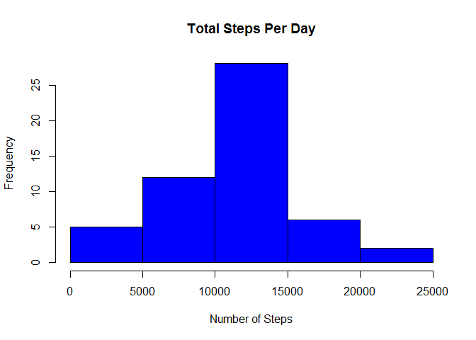
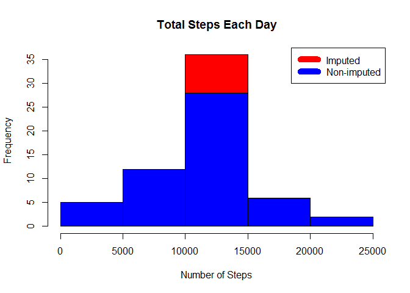

# Reproducible Research - PA1


## Loading and preprocessing the data

Download, unzip and load data into data frame `data`. 

```r
if(!file.exists("getdata-projectfiles-UCI HAR Dataset.zip")) {
        temp <- tempfile()
        download.file("http://d396qusza40orc.cloudfront.net/repdata%2Fdata%2Factivity.zip",temp)
        unzip(temp)
        unlink(temp)
}
data <- read.csv("activity.csv")
```


## What is mean total number of steps taken per day?

* Calculate the total number of steps taken per day. 
* Create Histogram.
* Calculate mean and median of total number of steps per day.

```r
steps_by_day <- aggregate(steps ~ date, data, sum)
hist(steps_by_day$steps, main = paste("Total Steps Per Day"), col="blue", xlab="Number of Steps")
```

 

```r
step_mean <- mean(steps_by_day$steps)
step_median <- median(steps_by_day$steps)
```

The `mean` is 1.0766189\times 10^{4} and the `median` is 10765.

## What is the average daily activity pattern?

* Time series plot (i.e. type = "l") of the 5-minute interval (x-axis) and the average number of steps taken, averaged across all days (y-axis).  
* Find interval which contains maximum number of steps. 

```r
steps_by_interval <- aggregate(steps ~ interval, data, mean)
plot(steps_by_interval$interval,steps_by_interval$steps, type="l", xlab="Interval", ylab="Number of Steps",main="Average Number of Steps per Day by Interval")
```

 

```r
max_interval <- steps_by_interval[which.max(steps_by_interval$steps),1]
```

The 5-minute interval, on average across all the days in the data set, containing the maximum number of steps is 835.

## Impute missing values. Compare imputed to non-imputed data.
* Calculate total numer of missing data
* Replace missing data with mean value of steps for given interval

```r
incomplete <- sum(!complete.cases(data))
imputed_data <- transform(data, steps = ifelse(is.na(data$steps), steps_by_interval$steps[match(data$interval, steps_by_interval$interval)], data$steps))
```

Total number of missing values is 2304,


* Recount total steps per day and create Histogram. 

```r
steps_by_day_imputed <- aggregate(steps ~ date, imputed_data, sum)
hist(steps_by_day_imputed$steps, main = paste("Total Steps Each Day"), col="red", xlab="Number of Steps")
hist(steps_by_day$steps, main = paste("Total Steps Each Day"), col="blue", xlab="Number of Steps", add=T)
legend("topright", c("Imputed", "Non-imputed"), col=c("red", "blue"), lwd=10)
```

 

Calculate new mean and median for imputed data. 

```r
step_mean_imputed <- mean(steps_by_day_imputed$steps)
step_median_imputed <- median(steps_by_day_imputed$steps)
```

Calculate difference between imputed and non-imputed data.

```r
mean_diff <- step_mean_imputed - step_mean
med_diff <- step_median_imputed - step_median
```

Calculate total difference.

```r
total_diff <- sum(steps_by_day_imputed$steps) - sum(steps_by_day$steps)
```
* The imputed data mean is 1.0766189\times 10^{4}
* The imputed data median is 1.0766189\times 10^{4}
* The difference between the non-imputed mean and imputed mean is 0
* The difference between the non-imputed mean and imputed mean is 1.1886792
* The difference between total number of steps between imputed and non-imputed data is 8.6129509\times 10^{4}. Thus, there were 8.6129509\times 10^{4} more steps in the imputed data.


## Are there differences in activity patterns between weekdays and weekends?
* Create a new factor variable in the dataset with two levels – “weekday” and “weekend” indicating whether a given date is a weekday or weekend day.

```r
weekdays <- c("Monday", "Tuesday", "Wednesday", "Thursday", "Friday")
```


```r
imputed_data$dow = as.factor(ifelse(is.element(weekdays(as.Date(imputed_data$date)),weekdays), "Weekday", "Weekend"))
steps_by_interval_dow <- aggregate(steps ~ interval + dow, imputed_data, mean)

library(lattice)
xyplot(steps_by_interval_dow$steps ~ steps_by_interval_dow$interval|steps_by_interval_dow$dow, main="Average Steps per Day by Interval",xlab="Interval", ylab="Steps",layout=c(1,2), type="l")
```

 

In weekdays the big difference between intervals is observed. However the total number of steps is pbserwed for weekends.
